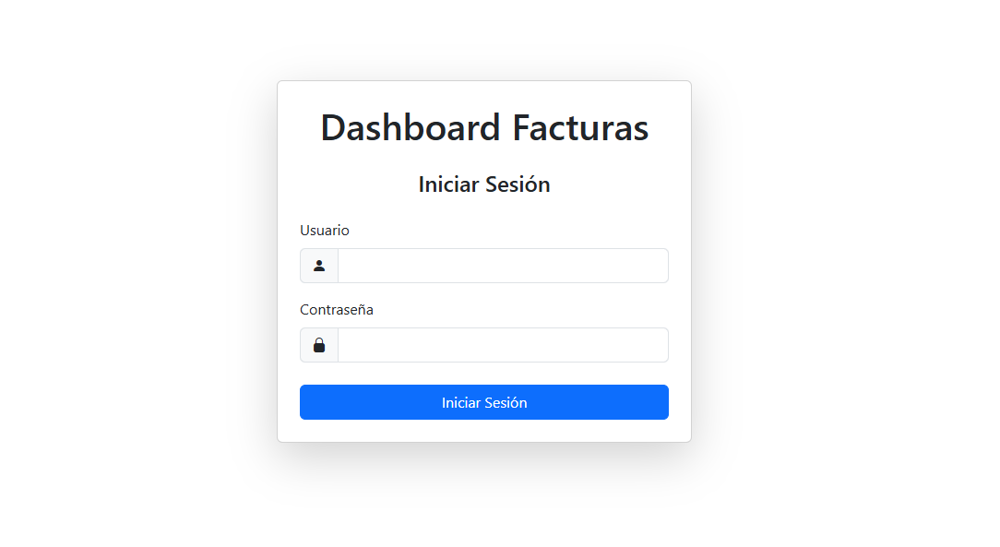
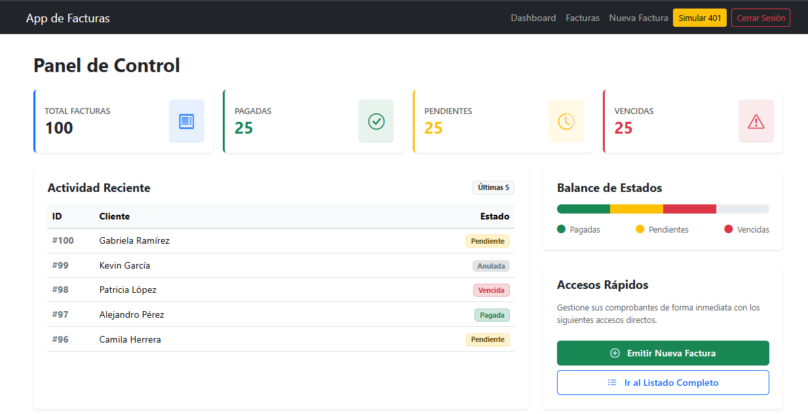
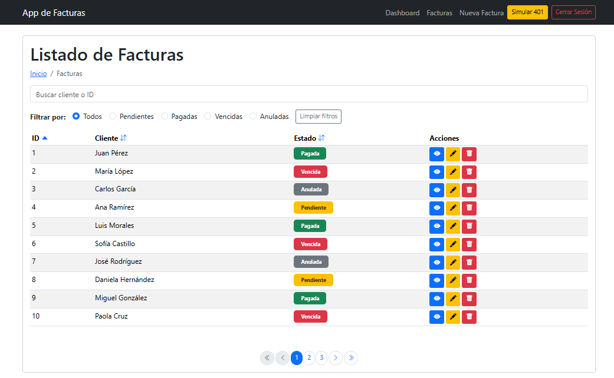
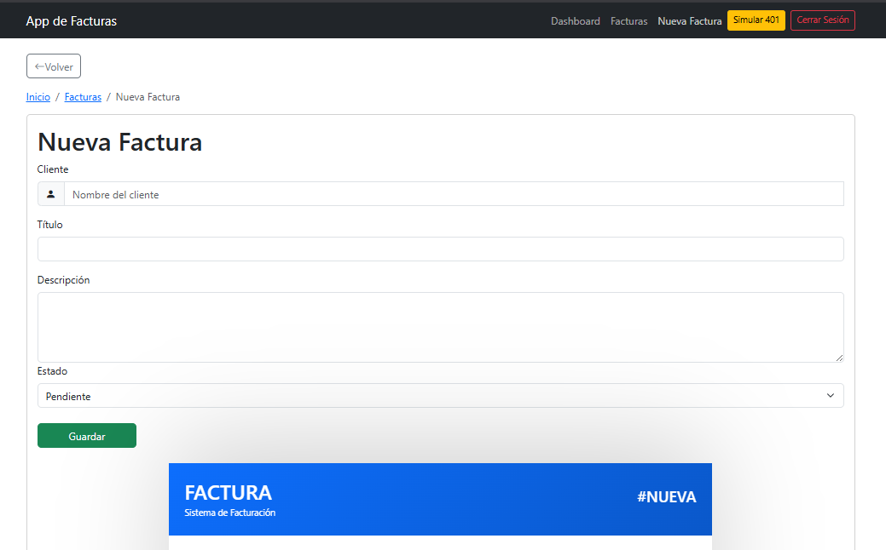
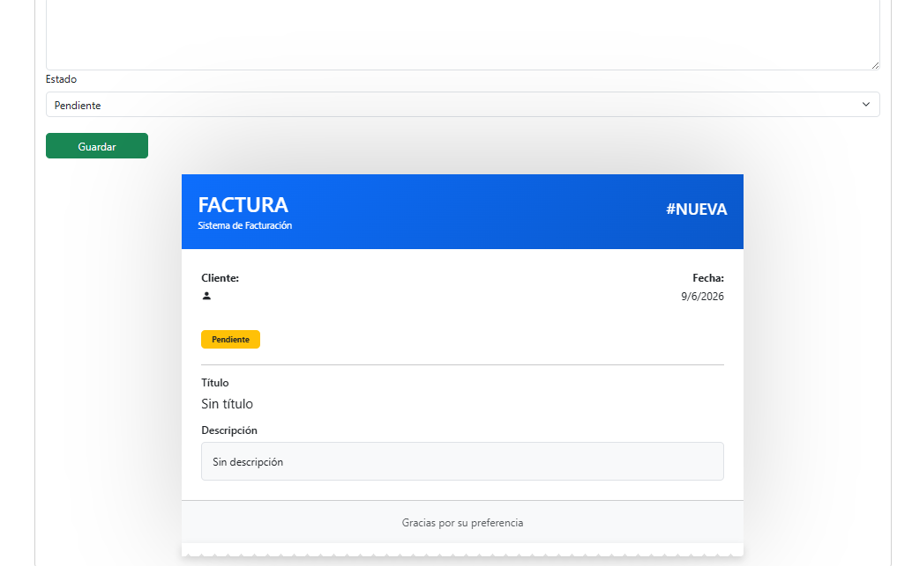
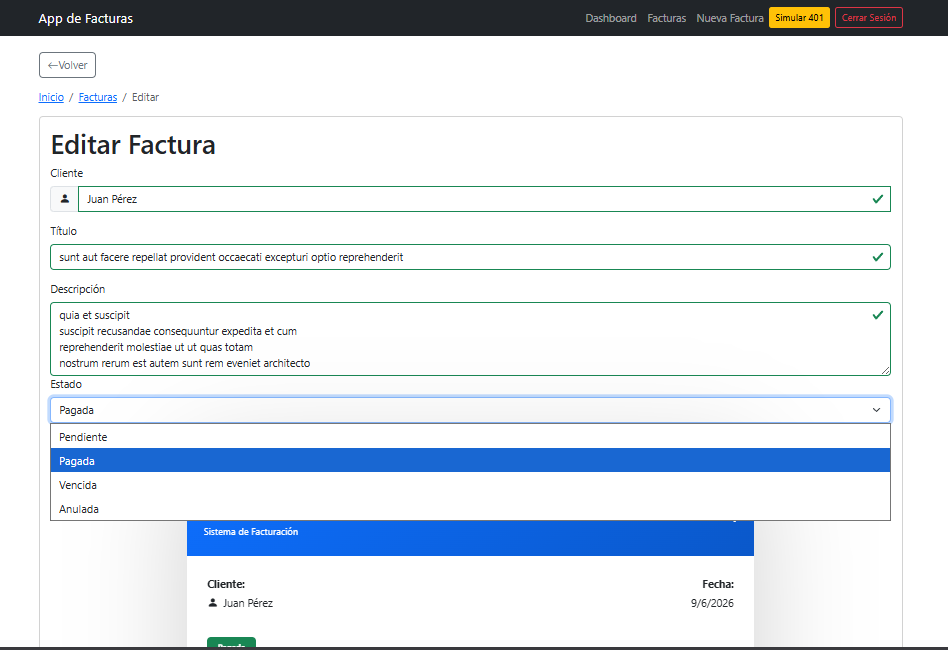
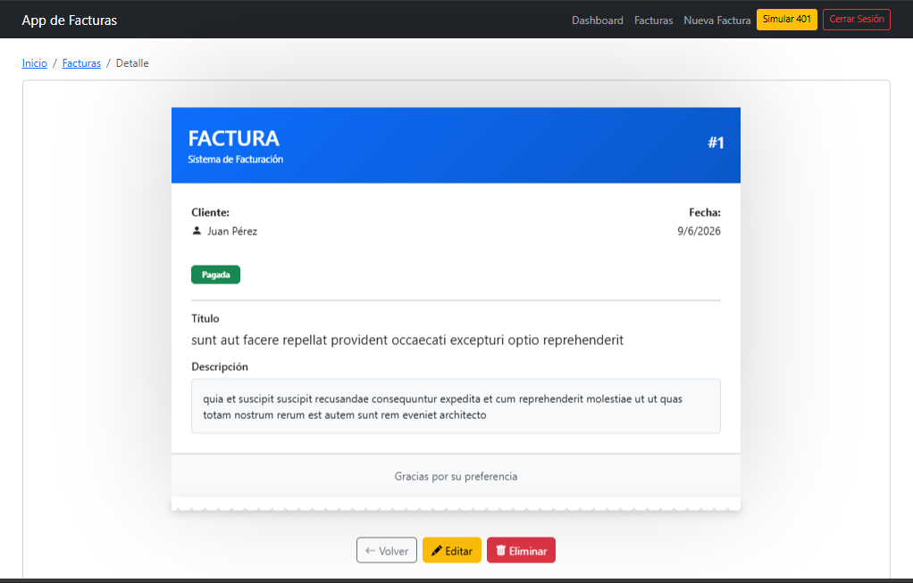

# Sistema de Gestión de Facturas

Aplicación web desarrollada con React para la gestión de facturas mediante operaciones CRUD simuladas utilizando la API pública JSONPlaceholder.

El proyecto implementa autenticación simulada, dashboard administrativo, listado de facturas, búsqueda, filtros, ordenamiento, paginación, formularios con validación en tiempo real, manejo global de estado mediante Context API y una interfaz responsive desarrollada con Bootstrap.

---

# Tabla de Contenidos

* Descripción del Proyecto
* Características Implementadas
* Capturas de Pantalla
* Arquitectura del Proyecto
* Decisiones Técnicas
* Tecnologías Utilizadas
* API Utilizada
* Instalación
* Uso del Proyecto
* Scripts Disponibles
* Credenciales de Prueba
* Manejo de Errores
* Diseño Responsive
* Autor

---

# Descripción del Proyecto

Este sistema fue desarrollado como una aplicación SPA (Single Page Application) utilizando React.

La aplicación permite administrar facturas mediante operaciones CRUD:

* Consultar facturas
* Ver detalle de una factura
* Crear nuevas facturas
* Editar facturas existentes
* Eliminar facturas
* Filtrar por estado
* Buscar por cliente o ID
* Ordenar registros
* Navegar mediante paginación

La información se obtiene desde JSONPlaceholder utilizando Axios.

Debido a que JSONPlaceholder no almacena cambios reales en su servidor, se implementó una capa de estado local mediante Context API para reflejar inmediatamente las operaciones realizadas por el usuario.

---

# Características Implementadas

## Autenticación

* Login simulado.
* Protección de rutas privadas.
* Cierre de sesión.
* Redirecciones automáticas.

---

## Dashboard

* Estadísticas dinámicas.
* Total de facturas.
* Facturas pendientes.
* Facturas pagadas.
* Facturas vencidas.
* Barra visual de estados.
* Últimas facturas registradas.
* Acciones rápidas.

---

## Gestión de Facturas

* Listado completo.
* Tabla responsive.
* Ordenamiento por columnas.
* Búsqueda por cliente.
* Búsqueda por ID.
* Filtros por estado.
* Paginación.

---

## Crear Factura

* Formulario reutilizable.
* Validación en tiempo real.
* Vista previa antes de guardar.
* Simulación de POST.
* Indicador de carga.
* Notificación de éxito.
* Limpieza automática del formulario.
* Actualización inmediata de la lista.

---

## Editar Factura

* Precarga de datos.
* Validaciones reutilizadas.
* Simulación de PUT.
* Actualización inmediata de la interfaz.

---

## Eliminar Factura

* Modal de confirmación.
* Simulación de DELETE.
* Actualización inmediata de la lista.
* Notificación de éxito.

---

## Manejo de Errores

* Try-Catch en operaciones asíncronas.
* Mensajes amigables para el usuario.
* Pantallas de error.
* Simulación de error 401.
* Toasts informativos.

---

# Capturas de Pantalla

## Login

<p align="center">
  
</p>

```text
screenshots/login.png
```

---

## Dashboard

<p align="center">
  
</p>

```text
screenshots/dashboard.png
```

---

## Listado de Facturas

<p align="center">
  
</p>

```text
screenshots/lfacturas.png
```

---

## Crear Factura

<p align="center">
  
</p>

---

<p align="center">
  
</p>

```text
screenshots/nueva-factura.png
```

---

## Editar Factura

<p align="center">
  
</p>

```text
screenshots/editar-factura.png
```

---

## Detalle de Factura

<p align="center">
  
</p>

```text
screenshots/detalle-factura.png
```

---

# Arquitectura del Proyecto

La aplicación está organizada siguiendo una arquitectura basada en componentes reutilizables y separación de responsabilidades.

## Estructura General

## Estructura del Proyecto

```text
react-dashFacturas/
│
├── public/
│   ├── 404.html
│   ├── favicon.svg
│   └── icons.svg
│
├── screenshots/
│   ├── dashboard.png
│   ├── detalle-factura.png
│   ├── editar-factura.png
│   ├── lfacturas.png
│   ├── login.png
│   ├── nueva-factura1.png
│   └── nueva-factura2.png
│
├── src/
│   ├── assets/
│   ├── components/
│   ├── context/
│   ├── hooks/
│   ├── layouts/
│   ├── pages/
│   ├── routes/
│   ├── services/
│   ├── utils/
│   │
│   ├── App.jsx
│   ├── App.css
│   ├── main.jsx
│   └── index.css
│
├── package.json
├── vite.config.js
└── README.md
```

## Arquitectura del Proyecto

La aplicación sigue una arquitectura modular basada en React, separando responsabilidades en carpetas específicas.

### components/

Contiene componentes reutilizables de interfaz:

- Navbar
- Breadcrumb
- FacturaForm
- FacturaTable
- DeleteModal
- InvoicePreview
- Pagination
- LoadingSpinner
- Toasts
- StatCard

### pages/

Contiene las páginas principales de la aplicación:

- Login
- Dashboard
- Facturas
- NuevaFactura
- EditarFactura
- FacturaDetalle

### context/

Implementa Context API para compartir estado global:

- AuthContext: autenticación
- FacturaContext: gestión de facturas
- ToastContext: notificaciones

### hooks/

Hooks personalizados:

- useAuth
- useFacturas

### services/

Encapsula toda la comunicación con la API:

- api.js
- facturaService.js

### routes/

Contiene la protección de rutas privadas mediante:

- PrivateRoute

### layouts/

Define la estructura visual compartida entre páginas:

- MainLayout

### utils/

Funciones auxiliares reutilizables:

- generadorClientes.js

### assets/

Recursos estáticos:

- Imágenes
- Íconos
- Logos

---

# Decisiones Técnicas

## React

Se utilizó React para construir una aplicación SPA basada en componentes reutilizables.

Ventajas:

* Reutilización de código.
* Mejor organización.
* Mantenimiento simplificado.

---

## Context API

Se implementó Context API para compartir datos globales sin necesidad de prop drilling.

Contextos implementados:

* AuthContext
* FacturaContext
* ToastContext

---

## Hook Personalizado

Se creó:

```javascript
useFacturas()
```

Para centralizar el acceso al estado global de facturas.

---

# Tecnologías Utilizadas

## Frontend

* React
* React Router DOM
* Bootstrap 5
* Bootstrap Icons
* Axios

## Herramientas

* Vite
* Git
* GitHub

---

# Librerías Utilizadas y Justificación

Además de React, se utilizaron las siguientes librerías para mejorar el desarrollo y la experiencia de usuario:

## React Router DOM

Permite implementar navegación entre páginas sin recargar el navegador.

Se utilizó para:

- Gestión de rutas.
- Navegación entre vistas.
- Rutas protegidas.
- Manejo de parámetros dinámicos.

Facilita la construcción de aplicaciones SPA modernas y mejora la experiencia de usuario al evitar recargas completas de página.

---

## Axios

Cliente HTTP utilizado para consumir la API JSONPlaceholder.

Se utilizó para:

- GET de facturas.
- POST de nuevas facturas.
- PUT de actualización.
- DELETE de eliminación.
- Manejo centralizado de errores.

Ofrece una sintaxis más limpia y potente que Fetch API, además de simplificar el manejo de respuestas y errores.

---

## Bootstrap 5

Framework CSS utilizado para el diseño visual de la aplicación.

Se utilizó para:

- Sistema de grillas responsive.
- Formularios.
- Tablas.
- Modales.
- Navbar.
- Tarjetas (Cards).
- Botones.
- Alertas.

Permite construir interfaces profesionales y adaptables a diferentes dispositivos reduciendo significativamente el tiempo de desarrollo.

---

## Bootstrap Icons

Biblioteca oficial de iconos de Bootstrap.

Se utilizó para:

- Acciones CRUD.
- Navegación.
- Indicadores visuales.
- Dashboard.

Mejora la usabilidad y la comprensión visual de la interfaz mediante iconografía consistente y ligera.

---

# API Utilizada

Base URL:

```text
https://jsonplaceholder.typicode.com
```

## Obtener Facturas

```http
GET /posts
```

Retorna una lista de facturas simuladas.

---

## Obtener Factura Individual

```http
GET /posts/:id
```

Retorna una factura específica.

---

## Crear Factura

```http
POST /posts
```

Body:

```json
{
  "title": "Nueva factura",
  "body": "Descripción",
  "userId": 1
}
```

---

## Actualizar Factura

```http
PUT /posts/:id
```

Body:

```json
{
  "title": "Título actualizado",
  "body": "Descripción actualizada"
}
```

---

## Eliminar Factura

```http
DELETE /posts/:id
```

Respuesta:

```json
{}
```

---

# Instalación

## Clonar repositorio

```bash
git clone URL_DEL_REPOSITORIO
```

---

## Ingresar al proyecto

```bash
cd nombre-del-proyecto
```

---

## Instalar dependencias

```bash
npm install
```

---

## Ejecutar entorno de desarrollo

```bash
npm run dev
```

---

## Generar build de producción

```bash
npm run build
```

---

## Vista previa de producción

```bash
npm run preview
```

---

# Uso del Proyecto

1. Iniciar sesión con las credenciales de prueba.
2. Acceder al dashboard principal.
3. Consultar el listado de facturas.
4. Crear nuevas facturas.
5. Editar facturas existentes.
6. Eliminar facturas.
7. Utilizar filtros, búsqueda y paginación.
8. Probar la simulación de error 401.

---

# Scripts Disponibles

## Desarrollo

```bash
npm run dev
```

Inicia el servidor local.

---

## Build

```bash
npm run build
```

Genera la versión optimizada para producción.

---

## Preview

```bash
npm run preview
```

Permite visualizar localmente la versión de producción.

---

# Credenciales de Prueba

Usuario:

```text
admin
```

Contraseña:

```text
1234
```

---

# Manejo de Errores

La aplicación implementa:

* Try-Catch en todas las peticiones.
* Mensajes amigables para el usuario.
* Fallback UI.
* Simulación de error HTTP 401.
* Notificaciones mediante Toast.
* Estados de carga mediante Spinner.

---

# Diseño Responsive

La interfaz fue diseñada para adaptarse a:

* Computadoras de escritorio.
* Tablets.
* Dispositivos móviles.

Se utilizaron:

* Bootstrap Grid System.
* Flexbox.
* Utilidades responsive de Bootstrap.

---

# Posibles Mejoras Futuras

* Persistencia real mediante backend propio.
* Base de datos relacional.
* Exportación PDF.
* Gestión de clientes.
* Dashboard con gráficos estadísticos.
* Roles y permisos.
* Búsqueda avanzada.

---

# Autor

**Marc**

Proyecto académico desarrollado como práctica de React para la gestión de facturas utilizando una API REST simulada y arquitectura basada en componentes.
